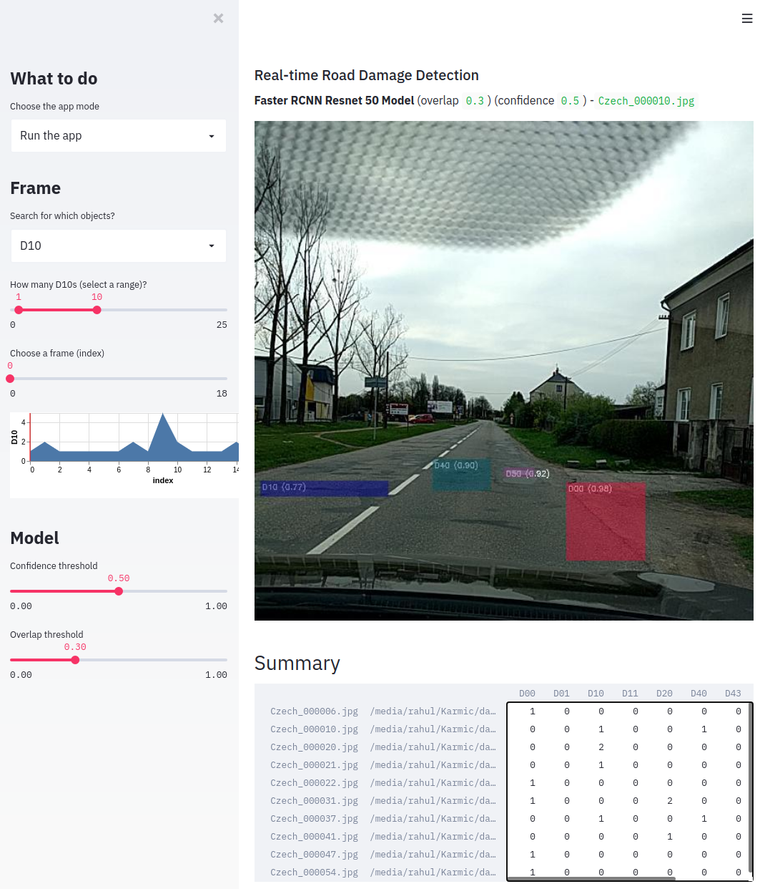

# Streamlit RDD Damage Image browser

## How to run this demo
```

pip install -r ../requirements
# assert torch.__version__.startswith("1.6")

pip install detectron2 -f https://dl.fbaipublicfiles.com/detectron2/wheels/cu101/torch1.6/index.html
pip install --upgrade streamlit opencv-python

streamlit run app.py
```


##### A. Test 1 Best Model
- run_d2_frcnn-fpn-combovt_b4096_v1_R101_Test1Best.zip
- Unzip and configure the model & Test1 images path in D2_rdd2020_test.py
- Detects only 4 classes of damages 

##### B. Test 2 Best Model 
- run_d2_frcnn-fpn-combovt_b640_v0_R50_Test2Best.zip
- Unzip and configure the model & Test2 images path in D2_rdd2020_test.py
- Detects only 4 classes of damages 

##### C. Streamlit Visualization
- BBox: model_bbox_e10k_class10_19Aug-faster_rcnn_R_50_FPN_3x.pth
- Segm: model_segm_e90k_class19_31Aug-deeplab_v3_plus_R_103_os16_mg124_poly_90k_bs16.pth
- Drop the *.pth files instreamlit/model directory
- This visualization is for all damages (10 damage classes) and requires setting up of Training data directory




### Questions? Comments?

Please ask in the [Streamlit community](https://discuss.streamlit.io).


